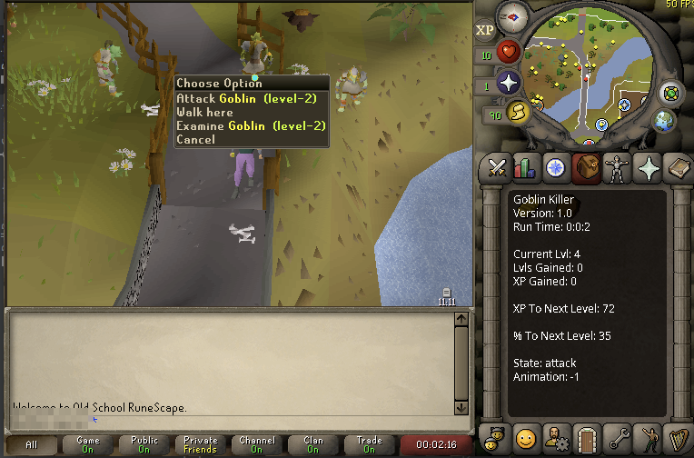

<h1 align="center">OSRSBot</h1>

An automation API for Old School RuneScape

  

<em style="font-size: 11px">OSRSBot automating the RuneLite client</em>

___

If you are interested in writing scripts go to the [script template](https://github.com/OSRSB/script-template)
* If you ask nicely and with **meaningful details** about your problem you may get some help.

## Community
* [Discord](https://discord.gg/CGBXNrHREP)

### What is OSRSBot?
OSRSBot is an API designed to aid in automating the gameplay of Old School RuneScape using RuneLite's 
third party client.

###### RuneLite?
RuneLite is an open-source API that seeks to enable a player to make 
quality of life improvements directly contradictory to the original goal outlined during the
creation of Old School RuneScape. Sure, games evolve, but when you have a plugin that tells you
exactly where to click during a quest then your claims to taking steps to prevent or reduce the ease
of botting are misplaced. Removing the deobfuscator months after it was publicly available and forked
led to the creation of OpenOSRS which hosted all the even shadier plugins that even RuneLite didn't
approve.

###### How RuneLite is used
Really, RuneLite only introduces more means to exploit the underlying game just by existing and having
a sizable contributor count. Using RuneLite to handle the client interaction code directly
we avoid having to take the workload of having to update our repository in respect to a game update.
This means more time can be spent focusing on building out the API functionality to aid script makers instead
of ensuring unrelated systems remain relevant.

### Using the Client

###### Set up
So, if you're a script user reading this then you can [click here](https://github.com/OSRSB/OSRSBot/releases/latest) 
to download the latest jar file. To run this file you'll need an installation of 
[JDK 17](https://www.oracle.com/java/technologies/javase/jdk17-archive-downloads.html) which can be obtained by clicking that link and 
downloading the version that matches your operating system. If you need help just jump into the community server and
ask. Alternatively, you can install it through IntelliJ IDEA by hitting File -> Project Structure -> Project -> Project SDK
and selecting the JDK version you want to use (or adding it).

###### Building

To build make sure to use the Gradle build tasks to build the classes or the jar task to build the jar.

###### Installing a script
To install a .jar script, put it in the following folder:

**Windows:** C:\\Users\\[username]\\OsrsBot\\Scripts\\Precompiled \
**Linux:** /home/[username]/.config/OsrsBot/Scripts/Precompiled \
**MacOS:** /Users/[username]/Library/Application Support/OsrsBot/Scripts/Precompiled

###### Running a script
You can then run the client by clicking the jar file twice (or from command-line if you choose) and waiting for 
RuneLite to initialize. After RuneLite has loaded you can hit our icon visible on the sidebar and open the 
interface. From here you can add accounts to a secure file storage system on your machine (stored in the location
you executed the jar) and after adding the login details swap to the script panel and execute your script by clicking
it to highlight it and then selecting the start button.
You're good to go now!
Stopping the script can be done by closing the client or by selecting stop or pause.

### Using the API
Most of the time as a script developer you won't really need to mess with the API directly beyond maybe a fork and
fixing a widgetID. That said if you need to test certain changes and behaviors feel free to ask for help.

#### Building Scripts
For the general populace though it isn't necessary, and you can simply refer to
[First Script Set Up](https://github.com/OSRSB/script-template#readme) 
You can follow the instructions there to get a feel for how to proceed in using the APIs in OSRSB to build 
automation tools for Old School RuneScape.

##### Wiki Links
If you do plan on operating within the API some quick wiki pages
to look over are:

1. [Setting up the project](https://github.com/OSRSB/RSB/wiki/Setting-up-the-project)
2. [Developing a script in the API environment](https://github.com/OSRSB/RSB/wiki/Developing-a-script-in-the-API-environment)
3. [Script Creation and Logic](https://github.com/OSRSB/RSB/wiki/Creating-a-script)
#### Running the API
To run you'll need to modify your program arguments to the following depending on how you wish it to run:

--bot-runelite
This runs the API, it uses the RuneLite interface

--ea
This enables assertions, it should never be used with bot mode.
It does need to be enabled for base RuneLite to use --developer-mode

--developer-mode
Enables the developer features in RuneLite stock and RuneLite API modes. 

VM args:
-debug
Activates debug log messages

After entering the program arguments you wish to enable (one mode only --runelite **OR**--bot-runelite)
it is ready to run.

#### Building
The project uses Gradle so to build a jar just click on the Gradle task in the Gradle menu.

##### Changing the API used in your script environment
If you're developing in your script environment, and you decide you wish to make changes to the API it is fairly 
manageable.
Script jars are not intended to be runnable (even if they're able to be). They're really just a zip file for the API
to load.
If the script is compiled without dependencies and only using the module compiled (script classes only) then 
you really only need to worry about directing the gradle.build to your local file system directory containing OSRSBot.

###### Simple
Adjusting a built output (class files not a jar) where they are in the Source folder in GService means that updates 
to the API are directly visible in your scripts on relaunching the application. 
I'd recommend using this option and have configured it to default to this behavior because it is far easier.
(Personally I just keep multiple windows of IntelliJ. One for each project. You could likely set 
up the script environment to be a module within the opened project). 
###### Advanced
Additionally, OSRSBot does enable a hacky in-environment test script folder that will compile on runtime of the 
API without any extra effort from you. Refer to the Wiki Links second bulletin.
If you find yourself constantly changing the OSRSBot API and 
testing your script then you might want to look into that.

#### Dependencies
So as any Java project might this one utilizes a few dependencies and as listed they are:
1. [RuneLite](https://github.com/runelite/runelite)
   - API is built to operate on top of RuneLite
2. [javassist](https://github.com/jboss-javassist/javassist)
   - Used loosely in anti-cheat precautions involving the use of
   instrumentation
3. [NaturalMouseMotion](https://github.com/JoonasVali/NaturalMouseMotion)
   - Used for making humanized mouse movements easier to implement
4. [junit](https://github.com/junit-team/junit4)
   - Used for making unit tests
5. [slf4j](https://github.com/qos-ch/slf4j)
   - Used for handling logging within the API
6. [jOpt Simple](https://github.com/jopt-simple/jopt-simple)
   - Used for easing the parsing of command-line arguments

## Contributing
Currently, I welcome any developer to join the few of us at our community discord for more direct conversation, but
opening issues is absolutely fine if they use the templates provided (or are reasonably made).
